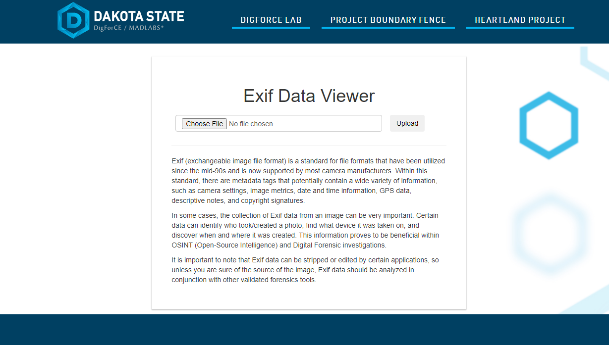

# Exif Viewer
[Exif Viewer](https://ren-exif-01.azurewebsites.net/digforce/exif/) is a web-based python tool that collects and reports Exif Tag values for uploaded images. Each value contains a description and an associated EXIF Tag ID. Works with any photo that contain EXIF data, such as .jpg, .jpeg, .png, and .gif. This app is currently deployed at https://madlabs.dsu.edu/digforce/exif.

<div align="center">
  
</div>&nbsp;

## Installation
1. Download [Python](https://www.python.org/downloads/) (version 3.11 or higher).
2. Clone the Repository:
```bash
git clone https://github.com/campwill/exif-viewer/
cd exif-viewer
```
3. Install Dependencies:
```bash
pip install -r requirements.txt
```

## Usage
While in the osint-dashboard directory, execute `python app.py` in the command line to start the development server.

By default, you can access the application at [http://127.0.0.1:5000/](http://127.0.0.1:5000/) in your web browser.

To stop the Flask development server, press `Ctrl+C` in the terminal where it is running.


## Notes
This app was made with no previous python, flask, or html experience. I have since come across technologies that would more appropriate for this project. This tool has since been integrated with [OSINT Dashboard](https://github.com/campwill/osint-dashboard), another one of my projects.
